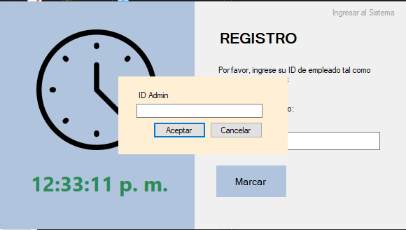
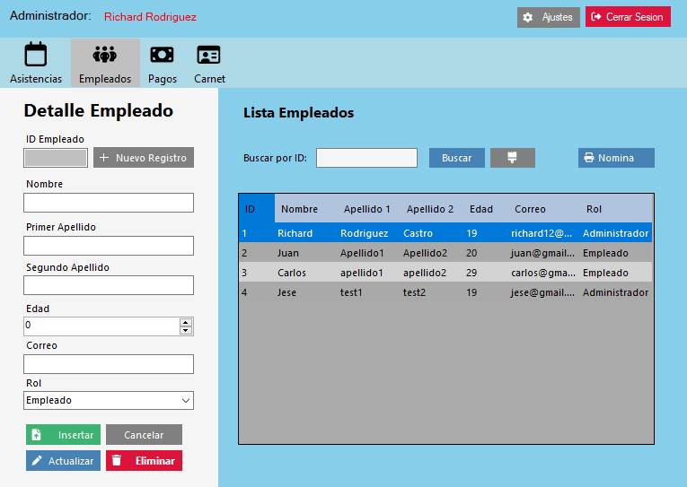
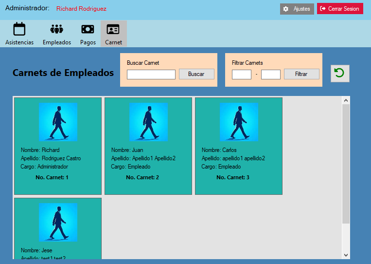

---

# HorarioPlus

**HorarioPlus** es una aplicación de gestión de empleados que facilita el seguimiento de asistencia y horas trabajadas, así como el cálculo de salarios basados en el tiempo registrado. La aplicación permite a los administradores y empleados registrar sus entradas y salidas, verificar asistencias, y gestionar los datos cronológicos y salariales.

## Características

- **Gestión de Empleados**: Almacena y organiza información de empleados, como nombre, edad, correo electrónico, rol, entre otros datos dentro de la empresa.
- **Registro de Tiempo**: Permite a los empleados registrar su hora de entrada y salida, y verifica automáticamente la asistencia.
- **Cálculo de Salarios**: Basado en las horas trabajadas y el pago por hora, se calcula el salario neto.
- **Manejo de Ausencias**: Identifica y gestiona automáticamente las ausencias de los empleados.
- **Interfaz Interactiva**: Mensajes de confirmación y error para mejorar la interacción con el usuario.

## Estructura del Proyecto

- **Clases principales:**
  - `GestionDelTiempo`: Maneja el registro del tiempo de los empleados, incluyendo entrada, salida y verificación de asistencia.
  - `ManejadorEmpleados`: Gestiona la carga, guardado, búsqueda, y actualización de los datos de empleados desde un archivo JSON.

### GestionDelTiempo

Esta clase es responsable de:
- Registrar las entradas y salidas de los empleados.
- Verificar la asistencia diaria.
- Buscar registros de tiempo por fecha.

### ManejadorEmpleados

Esta clase maneja las operaciones relacionadas con los empleados, tales como:
- Cargar y guardar la lista de empleados en un archivo JSON.
- Buscar empleados por ID.
- Generar un nuevo ID de empleado.
- Mostrar la lista actualizada de empleados en una tabla de datos.

## Ejemplo de Datos de Empleados

```json
[
  {
    "IdEmpleado": "1",
    "Nombre": "Richard",
    "Apellido1": "testApellido1",
    "Apellido2": "testApellido2",
    "Edad": 35,
    "Correo": "richardtest@gmail.com",
    "Rol": "Administrador",
    "PagoPorHoras": 50,
    "TotalHorasAcumuladas": 0,
    "SalarioNeto": 0,
    "HorarioEmpleado": null,
    "RegistroDelTiempo": [
      {
        "FechaMarcada": "2024-04-02T00:00:00-06:00",
        "Entrada_Marcada": "08:00:12",
        "EsTarde": false,
        "Salida_Marcada": "17:15:00",
        "Asistencia": true
      }
    ],
    "Marcado": true
  }
]
```
## Capturas de Pantalla

### Pantalla Principal



### Gestión de Empleados



### Sistema de Carnets



## Requisitos del Sistema

- .NET Framework 4.7.2 o superior
- Windows Forms
- Visual Studio 2019 o superior

## Cómo Ejecutar el Proyecto

1. Clonar o descargar este repositorio.
2. Abrir el proyecto en Visual Studio.
3. Configurar la ruta del archivo JSON en `ManejadorEmpleados` para que apunte al archivo de empleados.
4. Compilar y ejecutar el proyecto.

---
